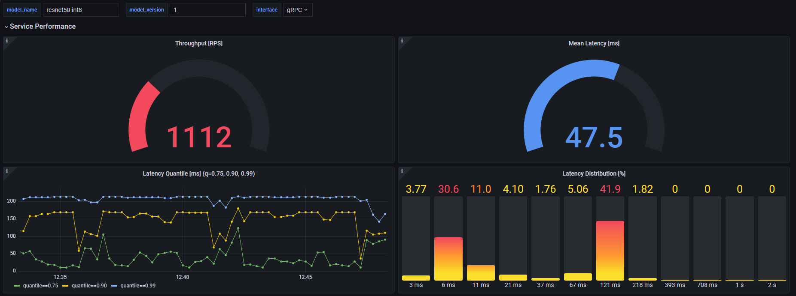
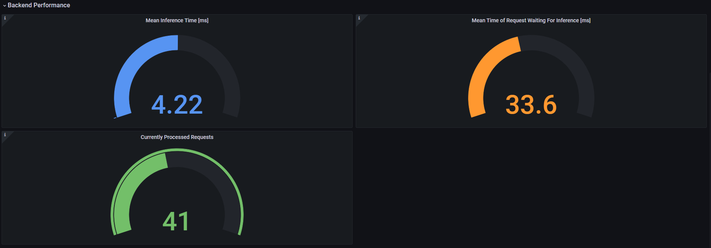

# Metrics {#ovms_docs_metrics}

## Introduction

This document describes how to use metrics endpoint in the OpenVINO Model Server. They can be applied for:

- Providing performance and utilization statistics for monitoring and benchmarking purposes

- Auto scaling of the model server instances in Kubernetes and OpenShift based on application related metrics

Built-in metrics allow tracking the performance without any extra logic on the client side or using network traffic monitoring tools like load balancers or reverse-proxies.

It also exposes metrics which are not related to the network traffic. 

For example, statistics of the inference execution queue, model runtime parameters etc. They can also track the usage based on model version, API type or requested endpoint methods.

OpenVINO Model Server metrics are compatible with [Prometheus standard](https://prometheus.io/docs)

They are exposed on the `/metrics` endpoint.

## Available metrics families

Metrics from default list are enabled with the `metrics_enable` flag or json configuration.

However, you can enable also additional metrics by listing all the metrics you want to enable in the `metric_list` flag or json configuration.


Default metrics
| Type      | Name | Labels | Description |
| :---    |    :----   |    :----   |    :----       |
| gauge      | ovms_streams | name,version | Number of OpenVINO execution streams. |
| gauge      | ovms_current_requests | name,version | Number of requests being currently processed by the model server. |
| gauge      | ovms_current_graphs | name | Number of MediaPipe graphs in process. |
| counter      | ovms_requests_success | api,interface,method,name,version | Number of successful requests to a model or a DAG. |
| counter      | ovms_requests_fail | api,interface,method,name,version | Number of failed requests to a model or a DAG. |
| counter      | ovms_requests_accepted | api,interface,method,name | Number of accepted requests which ended up inserting packet(s) into a MediaPipe graph. |
| counter      | ovms_requests_rejected | api,interface,method,name | Number of rejected which failed at MediaPipe packet creation step. |
| counter      | ovms_responses | api,interface,method,name | Number of responses generated by the MediaPipe graph. |
| histogram      | ovms_request_time_us | interface,name,version | Processing time of requests to a model or a DAG. |
| histogram      | ovms_inference_time_us | name,version | Inference execution time in the OpenVINO backend. |
| histogram      | ovms_wait_for_infer_req_time_us | name,version | Request waiting time in the scheduling queue. Indicates how long the request has to wait before required resources are assigned to it. |

Optional metrics
| Type      | Name | Labels | Description |
| :---    |    :----   |    :----   |    :----       |
| gauge      | ovms_infer_req_queue_size | name,version | Inference request queue size (nireq). |
| gauge      | ovms_infer_req_active | name,version | Number of currently consumed inference requests from the processing queue that are now either in the data loading or inference process. |

> **Note**: While `ovms_current_requests` and `ovms_infer_req_active` both indicate how much resources are engaged in the requests processing, they are quite distinct. A request is counted in `ovms_current_requests` metric starting as soon as it's received by the server and stays there until the response is sent back to the user. The `ovms_infer_req_active` counter informs about the number of OpenVINO Infer Requests that are bound to user requests and are either loading the data or already running inference. 

Labels description
| Name      | Values |  Description |
| :---    |    :----   |    :----   |
| api      | KServe, TensorFlowServing, V3  | Name of the serving API. |
| interface      | REST, gRPC | Name of the serving interface. |
| method      | ModelMetadata, ModelReady, ModelInfer, Predict, GetModelStatus, GetModelMetadata, Unary, Stream | Interface methods. |
| version      | 1, 2, ..., n | Model version. Note that GetModelStatus and ModelReady and all MediaPipe servables do not have the version label. |
| name      | As defined in model server config | Model name, DAG name or MediaPipe graph name. |


## Enable metrics

By default, the metrics feature is disabled.

Metrics endpoint is using the same port as the REST interface for running the model queries.

It is required to enable REST in the model server by setting the parameter --rest_port.

To enable default metrics set you need to specify the `metrics_enable` flag or json setting:

### Option 1: CLI

 ```bash
wget -N https://storage.openvinotoolkit.org/repositories/open_model_zoo/2022.1/models_bin/2/resnet50-binary-0001/FP32-INT1/resnet50-binary-0001.{xml,bin} -P models/resnet50/1
docker run -d -u $(id -u) -v $(pwd)/models:/models -p 9000:9000 -p 8000:8000 openvino/model_server:latest \
       --model_name resnet --model_path /models/resnet50 --port 9000 \
       --rest_port 8000 \
       --metrics_enable
 ```

### Option 2: Configuration file

```bash
mkdir workspace
wget -N https://storage.openvinotoolkit.org/repositories/open_model_zoo/2022.1/models_bin/2/resnet50-binary-0001/FP32-INT1/resnet50-binary-0001.{xml,bin} -P workspace/models/resnet50/1
echo '{
 "model_config_list": [
     {
        "config": {
             "name": "resnet",
             "base_path": "/workspace/models/resnet50"
        }
     }
 ],
 "monitoring":
     {
         "metrics":
         {
             "enable" : true
         }
     }
}' >> workspace/config.json
```

### Start with configuration file

```bash
docker run -d -u $(id -u) -v ${PWD}/workspace:/workspace -p 9000:9000 -p 8000:8000 openvino/model_server:latest \
       --config_path /workspace/config.json \
       --port 9000 --rest_port 8000
```

## Change the default list of metrics

You can enable from one up to all the metrics available at once.

To enable specific set of metrics you need to specify the metrics_list flag or json setting:

### Option 1: CLI

```bash
wget -N https://storage.openvinotoolkit.org/repositories/open_model_zoo/2022.1/models_bin/2/resnet50-binary-0001/FP32-INT1/resnet50-binary-0001.{xml,bin} -P models/resnet50/1
docker run -d -u $(id -u) -v $(pwd)/models:/models -p 9000:9000 -p 8000:8000 openvino/model_server:latest \
      --model_name resnet --model_path /models/resnet50  --port 9000 \
      --rest_port 8000 \
      --metrics_enable \
      --metrics_list ovms_requests_success,ovms_infer_req_queue_size
```

### Option 2: Configuration file

```bash
wget -N https://storage.openvinotoolkit.org/repositories/open_model_zoo/2022.1/models_bin/2/resnet50-binary-0001/FP32-INT1/resnet50-binary-0001.{xml,bin} -P models/resnet50/1
echo '{
 "model_config_list": [
     {
        "config": {
             "name": "resnet",
             "base_path": "/workspace/models/resnet50"
        }
     }
 ],
 "monitoring":
     {
         "metrics":
         {
             "enable" : true,
             "metrics_list": ["ovms_requests_success", "ovms_infer_req_queue_size"]
         }
     }
}' > workspace/config.json
```

### Start with configuration file

```bash
docker run -d -u $(id -u) -v ${PWD}/workspace:/workspace -p 9000:9000 -p 8000:8000 openvino/model_server:latest \
   --config_path /workspace/config.json \
   --port 9000 --rest_port 8000
```

### Configuration file with all metrics enabled

```bash
echo '{
 "model_config_list": [
     {
        "config": {
             "name": "resnet",
             "base_path": "/workspace/models/resnet50"
        }
     }
 ],
 "monitoring":
     {
         "metrics":
         {
             "enable" : true,
             "metrics_list": 
                 [ "ovms_requests_success",
                 "ovms_requests_fail",
                 "ovms_requests_accepted",
                 "ovms_requests_rejected",
                 "ovms_responses",
                 "ovms_inference_time_us",
                 "ovms_wait_for_infer_req_time_us",
                 "ovms_request_time_us",
                 "ovms_current_requests",
                 "ovms_current_graphs",
                 "ovms_infer_req_active",
                 "ovms_streams",
                 "ovms_infer_req_queue_size"]
         }
     }
}' > workspace/config.json
```

### Start with the configuration file above

```bash
docker run -d -u $(id -u) -v ${PWD}/workspace:/workspace -p 9000:9000 -p 8000:8000 openvino/model_server:latest \
   --config_path /workspace/config.json \
   --port 9000 --rest_port 8000
```

## Example response from metrics endpoint

To use data from metrics endpoint you can use the curl command:
```bash
curl http://localhost:8000/metrics
```
[Example metrics output](https://raw.githubusercontent.com/openvinotoolkit/model_server/releases/2025/2/docs/metrics_output.out)

## Performance considerations
Collecting metrics has negligible performance overhead when used with models of average size and complexity. However when used with very lightweight, fast models which inference time is very short, the metric incrementation can take noticeable proportion of the processing time. Consider it while enabling metrics for such models.

## Metrics implementation for DAG pipelines

For [DAG pipeline](dag_scheduler.md) execution there are relevant 3 metrics listed below.
They track the execution of the whole pipeline, gathering information from all pipeline nodes. 

DAG metrics

| Type      | Name  | Description |
| :---    |    :----   |    :----   |
| counter |    ovms_requests_success  |             Number of successful requests to a model or a DAG. |
| counter  |   ovms_requests_fail    |              Number of failed requests to a model or a DAG. |
| histogram |  ovms_request_time_us |               Processing time of requests to a model or a DAG. |

The remaining metrics track the execution for the individual models in the pipeline separately.
It means that each request to the DAG pipeline will update also the metrics for all individual models used as the execution nodes.

## Metrics implementation for MediaPipe Graphs

For [MediaPipe Graphs](./mediapipe.md) execution there are 6 generic metrics which apply to all graphs:

| Type      | Name  | Description |
| :---    |    :----   |    :----   |
| counter      | ovms_requests_accepted | Counts number of requests which ended up pushing MediaPipe packet down the graph stream. For example image frame in vision use cases, LLM prompt in text generation use cases. |
| counter      | ovms_requests_rejected | Counts errors in MediaPipe packet creation phase. For example bad image format in vision use cases. Please note that for V3 API, the LLM request is validated at graph node level meaning that packet creation always succeeds. Please refer to specific graph definition and implementation. |
| counter      | ovms_responses | Useful to track number of packets generated by MediaPipe graph. Keep in mind that single request may trigger production of multiple (or zero) packets, therefore tracking number of responses is complementary to tracking accepted requests. For example tracking streaming partial responses of LLM text generation graphs. |
| gauge      | ovms_current_graphs | Number of graphs currently in-process. For unary communication it is equal to number of currently processing requests (each request initializes separate MediaPipe graph). For streaming communication it is equal to number of active client connections. Each connection is able to reuse the graph and decide when to delete it when the connection is closed. |
| counter      | ovms_graph_error | Counts errors in MediaPipe graph execution phase. For example V3 LLM text generation fails in LLMCalculator due to missing prompt - calculator returns an error and graph cancels. |
| histogram      | ovms_graph_processing_time_us | Tracks duration of successfully started mediapipe graphs in us. It can represent pipeline processing time for unary calls or the session length for streamed requests. |
| histogram      | ovms_graph_request_latency_us | Difference between MediaPipe packet timestamps at the time of creation (request receival) and when the packet generation has concluded (full or partial response). Server automatically timestamps the incoming  packets and is used as a source of truth for receival time, unless client opts-in to manual timestamping (NOTE: manual timestamping causes the metric results to become invalid). |

Exposing custom metrics in calculator implementations (MediaPipe graph nodes) is not supported yet.


## Visualize with Grafana

With server metrics being scraped by [Prometheus](https://prometheus.io/) it is possible to integrate [Grafana](https://grafana.com/) to visualize them on the dashboards. Once you have Grafana configured with Prometheus as a data source, you can create your own dashboard or import one. 

In OpenVINO Model Server repository you can find [grafana_dashboard.json](https://github.com/openvinotoolkit/model_server/blob/releases/2025/2/extras/grafana_dashboard.json) file that can be used to visualize per model metrics like:
- Throughput [RPS] - number of requests being processed by the model per second.
- Mean Latency [ms] - latency averaged across all requests processed by the model in a certain timeframe.
- Latency Quantile [ms] - value of latency for quantiles [0.75, 0.90, 0.99], meaning the latency that has NOT been exceeded by 75%, 90% and 99% of the requests.
- Latency Distribution [%] - distribution of the latencies across the buckets.
- Mean Inference Time [ms] - time of inference execution, averaged across all requests processed by the model in a certain timeframe.
- Mean Time of Request Waiting For Inference [ms] - time of a request waiting for the inference execution, averaged across all requests processed by the model in a certain timeframe.
- Currently Processed Requests - Number of requests being currently processed by the model server.

The dashboard works with three variables: `model_name`, `model_version` and `interface` that determine the model instance and interface (gRPC or REST) of interest. The `interface` value is ignored for panels with: `Mean Inference Time`, `Mean Time of Request Waiting For Inference`, `Currently Processed Requests` as they concern only backend performance and are interface agnostic.



