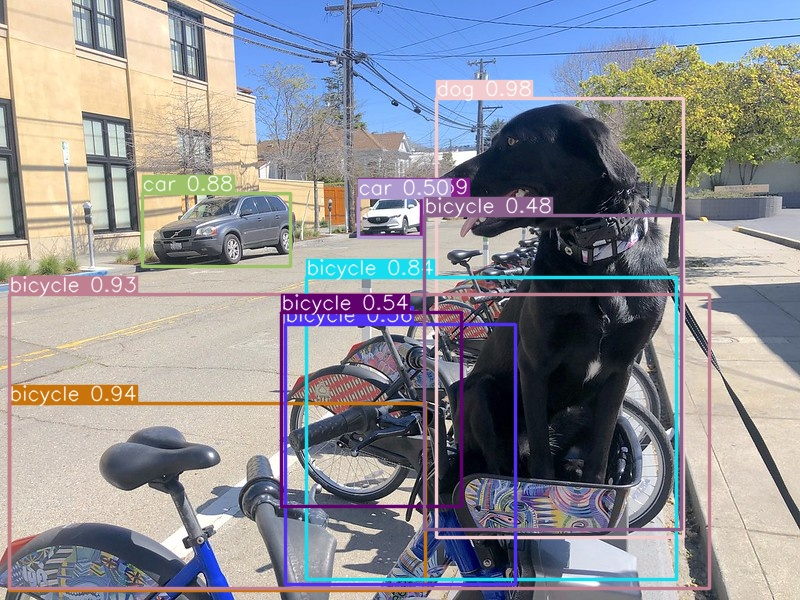

# QuickStart - classic models {#ovms_docs_quick_start_guide}

OpenVINO Model Server can perform inference using pre-trained models in either [OpenVINO IR](https://docs.openvino.ai/2025/documentation/openvino-ir-format/operation-sets.html)
, [ONNX](https://onnx.ai/), [PaddlePaddle](https://github.com/PaddlePaddle/Paddle) or [TensorFlow](https://www.tensorflow.org/) format. You can get them by:

- downloading models from [Open Model Zoo](https://storage.openvinotoolkit.org/repositories/open_model_zoo/)
- generating the model in a training framework and saving it to a supported format: TensorFlow saved_model, ONNX or PaddlePaddle.
- downloading the models from models hubs like [Kaggle](https://www.kaggle.com/models) or [ONNX models zoo](https://github.com/onnx/models).
- converting models from any formats using [conversion tool](https://docs.openvino.ai/2025/openvino-workflow/model-preparation/convert-model-to-ir.html)

This guide uses a [Faster R-CNN with Resnet-50 V1 Object Detection model](https://www.kaggle.com/models/tensorflow/faster-rcnn-resnet-v1/tensorFlow2/faster-rcnn-resnet50-v1-640x640/1) in TensorFlow format.

> **Note**: - OpenVINO Model Server can run on Linux, macOS and Windows both on [WSL](https://docs.microsoft.com/en-us/windows/wsl/) and as a standalone ovms.exe.

To quickly start using OpenVINO™ Model Server follow these steps:
1. Prepare Docker
2. Download the OpenVINO™ Model server
3. Provide a model
4. Start the Model Server Container
5. Prepare the Example Client Components
6. Download data for inference
7. Run inference
8. Review the results

## Prerequisites

**Model preparation**: Python 3.9 or higher with pip 

**Model Server deployment**: Installed Docker Engine or OVMS binary package according to the [baremetal deployment guide](deploying_server_baremetal.md)


### Step 1: For Linux prepare Docker

To verify installation, test it using the following command. If it displays a test image and a message, it is ready.

``` bash
$ docker run hello-world
```

### Step 2: For Linux download the Model Server

Download the Docker image that contains OpenVINO Model Server:

```bash
docker pull openvino/model_server:latest
```

### Step 3: Provide a Model 

Store components of the model in the `model/1` directory. Here are example commands pulling an object detection model from Kaggle:

```console
curl --create-dir https://www.kaggle.com/api/v1/models/tensorflow/faster-rcnn-resnet-v1/tensorFlow2/faster-rcnn-resnet50-v1-640x640/1/download -o model/1/1.tar.gz
tar xzf 1.tar.gz -C model/1
```

OpenVINO Model Server expects a particular folder structure for models - in this case `model` directory has the following content:
```console
model
└── 1
    ├── saved_model.pb
    └── variables
        ├── variables.data-00000-of-00001
        └── variables.index
```

Sub-folder `1` indicates the version of the model. If you want to upgrade the model, other versions can be added in separate subfolders (2,3...).
For more information about the directory structure and how to deploy multiple models at a time, check out the following sections:
- [Preparing models](models_repository.md)
- [Serving models](starting_server.md)
- [Serving multiple model versions](model_version_policy.md)

### Step 4: Start the Model Server
:::{dropdown} **Deploying with Docker**
```bash
docker run -d -u $(id -u) --rm -v ${PWD}/model:/model -p 9000:9000 openvino/model_server:latest --model_name faster_rcnn --model_path /model --port 9000
```

During this step, the `model` folder is mounted to the Docker container.  This folder will be used as the model storage.
:::
:::{dropdown} **Deploying on Bare Metal**
Assuming you have unpacked model server package, make sure to:

- **On Windows**: run `setupvars` script
- **On Linux**: set `LD_LIBRARY_PATH` and `PATH` environment variables

as mentioned in [deployment guide](../../../docs/deploying_server_baremetal.md), in every new shell that will start OpenVINO Model Server.
```bat
ovms --model_name faster_rcnn --model_path model --port 9000
```
:::
### Step 5: Prepare the Example Client Components

Client scripts are available for quick access to the Model Server. Run an example command to download all required components:

```console
wget https://raw.githubusercontent.com/openvinotoolkit/model_server/main/demos/object_detection/python/object_detection.py
wget https://raw.githubusercontent.com/openvinotoolkit/model_server/main/demos/object_detection/python/requirements.txt
wget https://raw.githubusercontent.com/openvinotoolkit/open_model_zoo/master/data/dataset_classes/coco_91cl.txt
```

Check more information about the [writing the client applications](./writing_app.md).

### Step 6: Download Data for Inference

This example uses the file [coco_bike.jpg](https://storage.openvinotoolkit.org/repositories/openvino_notebooks/data/data/image/coco_bike.jpg). Run the following command to download the image:

```console
wget https://storage.openvinotoolkit.org/repositories/openvino_notebooks/data/data/image/coco_bike.jpg
```

### Step 7: Run Inference

Go to the folder with the client script and install dependencies. Create a folder for inference results and run the client script:

```console
pip install --upgrade pip
pip install -r requirements.txt

python object_detection.py --image coco_bike.jpg --output output.jpg --service_url localhost:9000
```

### Step 8: Review the Results

In the current folder, you can find files containing inference results.
In our case, it will be a modified input image with bounding boxes indicating detected objects and their labels.



> **Note**: Similar steps can be performed with other model formats. Check the [ONNX use case example](../demos/using_onnx_model/python/README.md),
[TensorFlow classification model demo](../demos/image_classification_using_tf_model/python/README.md)
or [PaddlePaddle model demo](../demos/classification_using_paddlepaddle_model/python/README.md).

Congratulations, you have completed the QuickStart guide. Try other Model Server [demos](../demos/README.md) or explore more [features](features.md) to create your application.
Check also how to write the client code using [TFS API](./clients_tfs.md) and [KServe API](./clients_kfs.md)
