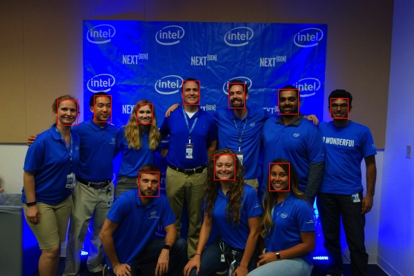

# Quickstart Guide {#ovms_docs_quick_start_guide}

OpenVINO Model Server can perform inference using pre-trained models in either [OpenVINO IR](https://docs.openvino.ai/2023.0/openvino_docs_MO_DG_IR_and_opsets.html#doxid-openvino-docs-m-o-d-g-i-r-and-opsets) 
, [ONNX](https://onnx.ai/), [PaddlePaddle](https://github.com/PaddlePaddle/Paddle) or [TensorFlow](https://www.tensorflow.org/) format. You can get them by:

- downloading models from [Open Model Zoo](https://storage.openvinotoolkit.org/repositories/open_model_zoo/public/2022.1/)
- converting other formats using [Model Optimizer](https://docs.openvino.ai/2023.0/openvino_docs_MO_DG_Deep_Learning_Model_Optimizer_DevGuide.html)

This guide uses a [face detection model](https://docs.openvino.ai/2023.0/omz_models_model_face_detection_retail_0004.html) in IR format.

To quickly start using OpenVINO™ Model Server follow these steps:
1. Prepare Docker
2. Download or build the OpenVINO™ Model server
3. Provide a model
4. Start the Model Server Container
5. Prepare the Example Client Components
6. Download data for inference
7. Run inference
8. Review the results

### Step 1: Prepare Docker

[Install Docker Engine](https://docs.docker.com/engine/install/), including its [post-installation steps](https://docs.docker.com/engine/install/linux-postinstall/), on your development system. 
To verify installation, test it using the following command. If it displays a test image and a message, it is ready.

``` bash
$ docker run hello-world
``` 

### Step 2: Download the Model Server

Download the Docker image that contains OpenVINO Model Server:

```bash
docker pull openvino/model_server:latest
```

### Step 3: Provide a Model

Store components of the model in the `model/1` directory. Here is an example command using curl and a face detection model:

```bash
curl --create-dirs https://storage.openvinotoolkit.org/repositories/open_model_zoo/2022.1/models_bin/2/face-detection-retail-0004/FP32/face-detection-retail-0004.xml https://storage.openvinotoolkit.org/repositories/open_model_zoo/2022.1/models_bin/2/face-detection-retail-0004/FP32/face-detection-retail-0004.bin -o model/1/face-detection-retail-0004.xml -o model/1/face-detection-retail-0004.bin
```

> **NOTE**: For ONNX models additional steps are required. For a detailed description refer to our [ONNX format example](../demos/using_onnx_model/python/README.md).

OpenVINO Model Server expects a particular folder structure for models - in this case `model` directory has the following content: 
```bash
model/
└── 1
    ├── face-detection-retail-0004.bin
    └── face-detection-retail-0004.xml
``` 
Sub-folder 1 indicates the version of the model. If you want to upgrade the model, other versions can be added in separate subfolders (2,3...). 
For more information about the directory structure and how to deploy multiple models at a time, check out the following sections:
- [Preparing models](models_repository.md)
- [Serving models](starting_server.md)
- [Serving multiple model versions](model_version_policy.md) 

### Step 4: Start the Model Server Container

Start the container:

```bash
docker run -d -u $(id -u):$(id -g) -v $(pwd)/model:/models/face-detection -p 9000:9000 openvino/model_server:latest \
--model_path /models/face-detection --model_name face-detection --port 9000 --shape auto
```
During this step, the `model` folder is mounted to the Docker container.  This folder will be used as the model storage from which the server will access models.

### Step 5: Prepare the Example Client Components

Client scripts are available for quick access to the Model Server. Run an example command to download all required components:

```bash
curl --fail https://raw.githubusercontent.com/openvinotoolkit/model_server/releases/2022/3/demos/common/python/client_utils.py -o client_utils.py https://raw.githubusercontent.com/openvinotoolkit/model_server/releases/2022/3/demos/face_detection/python/face_detection.py -o face_detection.py https://raw.githubusercontent.com/openvinotoolkit/model_server/releases/2022/3/demos/common/python/requirements.txt -o client_requirements.txt
```

For more information, check these links:
- [Information on the face detection script](../demos/face_detection/python/README.md)
- [More Model Server client scripts](../demos/README.md)
- [Clients](./clients.md)

### Step 6: Download Data for Inference

Put the files in a separate folder to provide inference data, as inference will be performed on all the files it contains.

You can download [example images for inference](https://github.com/openvinotoolkit/model_server/tree/releases/2022/1/demos/common/static/images/people). This example uses the file [people1.jpeg](https://github.com/openvinotoolkit/model_server/tree/releases/2022/1/demos/common/static/images/people/people1.jpeg). Run the following command to download the image:

```bash
curl --fail --create-dirs https://raw.githubusercontent.com/openvinotoolkit/model_server/releases/2022/1/demos/common/static/images/people/people1.jpeg -o images/people1.jpeg
```

### Step 7: Run Inference

Go to the folder with the client script and install dependencies. Create a folder for inference results and run the client script:

```bash
pip install --upgrade pip
pip install -r client_requirements.txt

mkdir results

python face_detection.py --batch_size 1 --width 600 --height 400 --input_images_dir images --output_dir results --grpc_port 9000
```

### Step 8: Review the Results

You will see the inference output:

```bash
Start processing 1 iterations with batch size 1
Request shape (1, 3, 400, 600)
Response shape (1, 1, 200, 7)
image in batch item 0 , output shape (3, 400, 600)
detection 0 [[[0.         1.         1.         0.55241716 0.3024692  0.59122956
   0.39170963]]]
x_min 331
y_min 120
x_max 354
y_max 156...
```

In the `results` folder, you can find files containing inference results. 
In our case, it will be a modified input image with bounding boxes indicating detected faces.


Note: Similar steps can be performed with an ONNX model. Check the inference [use case example](../demos/using_onnx_model/python/README.md) with a public ResNet model in ONNX format
or [TensorFlow model demo](../demos/image_classification_using_tf_model/python/README.md ).

Congratulations, you have completed the Quickstart guide. Try Model Server [demos](../demos/README.md) or explore more [features](features.md) to create your application.
