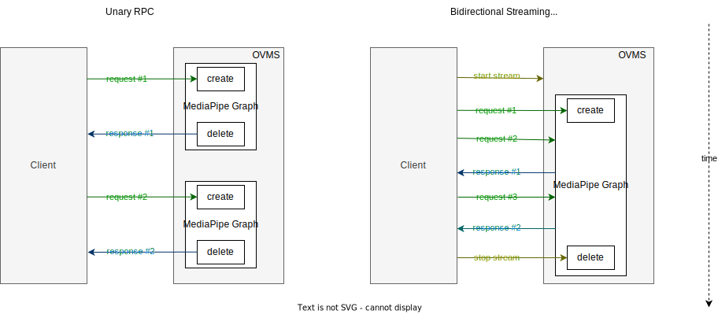

# gRPC Streaming API {#ovms_docs_streaming_endpoints}

## Introduction
OpenVINO Model Server implements gRPC KServe extension which adds separate RPC for [bidirectional streaming](https://grpc.io/docs/what-is-grpc/core-concepts/#bidirectional-streaming-rpc) use cases. It means that besides unary RPC, where client sends a single request and gets back a single response, client is able to initiate connection and send/receive messages in any number and order using `ModelStreamInfer` procedure:

```
service GRPCInferenceService
{
  ...
  // Standard
  rpc ModelInfer(ModelInferRequest) returns (ModelInferResponse) {}
  // Extension
  rpc ModelStreamInfer(stream ModelInferRequest) returns (stream ModelStreamInferResponse) {}
  ...
}
```

This becomes very useful for serving [MediaPipe Graphs](./mediapipe.md). In unary inference RPC, each request is using separate and independent MediaPipe graph instance.
However, in streaming inference RPC MediaPipe graph is created only once per the client session, and is reused by subsequent requests to the same gRPC stream.

- This avoids graph initialization overhead and increases its overall throughput
- Allows to preserve state between subsequent incoming requests
- Enables source calculators to stream multiple responses without feeding input packets




## Graph Selection
After opening a stream, the first gRPC request defines which graph definition will be selected for execution (`model_name` proto field).
Afterwards, subsequent requests are required to match the servable name and version, otherwise the error is reported and input packets are not pushed to the graph. However, the graph remains available for correct requests.

> **NOTE**: The server closes the stream after the first request if requested graph does not exist or is retired.

## Timestamping
MediaPipe Graphs require packets to include timestamp information for synchronization purposes. Each input stream in the graph requires timestamps to be monotonically increasing. Read further about [MediaPipe timestamping](https://developers.google.com/mediapipe/framework/framework_concepts/synchronization#timestamp_synchronization).

### Automatic timestamping
By default OpenVINO Model Server assigns timestamps automatically. Each gRPC request is treated as separate point on the timeline, starting from 0. Each request is deserialized sequentially and increases the timestamp by 1.

> **NOTE**: It means that in order to send multiple inputs with the same timestamp, client needs to pack it into single request (or use manual timestamping).

### Manual timestamping
Optionally, the client is allowed to include timestamp manually via request parameter `OVMS_MP_TIMESTAMP`. It is applied to all the packets deserialized from the request.

It is possible to mix manual/automatic timestamping. After correct deserialization step, default automatic timestamp is always equal to `previous_timestamp + 1`.

Adding timestamp to the request using `tritonclient` (python pip package):
```
FRAME_TIMESTAMP_US = 43166520112  # example value
TIMESTAMP_PARAM_NAME = 'OVMS_MP_TIMESTAMP'

triton_client.async_stream_infer(model_name=graph_name,
                                 inputs=inputs,
                                 parameters={TIMESTAMP_PARAM_NAME: FRAME_TIMESTAMP_US})
```


### Reading stream responses
Once MediaPipe graph has single output packet ready, it is immediately serialized into gRPC response and sent back to the client. Since all MediaPipe packets contain timestamp information, OpenVINO Model Server includes it in the message. It is useful for synchronization purposes on the client side of an application.

```
TIMESTAMP_PARAM_NAME = 'OVMS_MP_TIMESTAMP'

def callback(result, error):
  ...
  timestamp = result.get_response().parameters[TIMESTAMP_PARAM_NAME].int64_param
```


## Preserving State Between Requests
Note that subsequent requests in a stream have access to the same instance of MediaPipe graph. It means that it is possible implement graph that saves intermediate state and act in stateful manner. It might be an advantage f.e. for object tracking use cases.

## Error handling
The MediaPipe graph is checked for internal processing errors in-between subsequent client stream read operations. In case the graph encountered unrecoverable error, its message is returned to the client and the stream is closed.

## Useful links
- [example client snippets](./clients_kfs.md)
- [complete demo with streaming](../demos/mediapipe/holistic_tracking/README.md)

> **NOTE**: gRPC Streaming API supports only MediaPipe Graph servables via KServe API compatible client like `tritonclient`.

