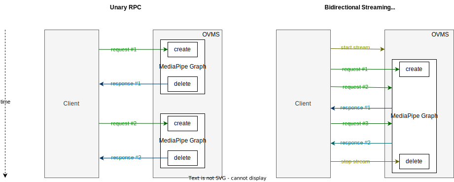

# Streaming API (preview) {#ovms_docs_streaming_endpoints}

## Introduction
OpenVINO Model Server implements gRPC KServe extension which adds separate RPC for [bidirectional streaming](https://grpc.io/docs/what-is-grpc/core-concepts/#bidirectional-streaming-rpc) use cases. It means that besides unary RPC, where client sends a single request and gets back a single response, client is able to initiate connection and send/receive messages in any number and order using `ModelStreamInfer` procedure:

```
service GRPCInferenceService
{
  ...
  // Standard
  rpc ModelInfer(ModelInferRequest) returns (ModelInferResponse) {}
  // Extension
  rpc ModelStreamInfer(stream ModelInferRequest) returns (stream ModelStreamInferResponse) {}
  ...
}
```

This becomes very useful for endpoints serving [MediaPipe Graphs](./mediapipe.md). In unary inference RPC each request initializes new MediaPipe graph, inputs are deserialized into MediaPipe packets and pushed into the graph. After the graph is done, it is deleted.
However, in streaming inference RPC MediaPipe graph is created only once per connection, and is reused by subsequent requests to the same gRPC stream. This removes graph initialization overhead and increases its overall throughput.



## Graph Selection
Opening stream is not enough to create execution graph. Instead, the first gRPC request after the opening defines which graph definition will be selected for execution (`model_name` and `model_version` proto fields). The server closes the stream in case the graph is non-existent or retired.
Subsequent requests are required to match the servable name and version, otherwise the error is reported and input packets are not pushed to the graph. However, the graph remains in available for correct requests.

## Timestamping
MediaPipe Graphs require packets to include timestamp information for synchronization. Each input stream in the graph requires packets to be monotonically increasing. Read further about [MediaPipe timestamping](https://developers.google.com/mediapipe/framework/framework_concepts/synchronization#timestamp_synchronization).

### Automatic timestamping
By default OpenVINO Model Server assigns timestamps automatically. Each gRPC request is treated as separate point on the timeline, starting from 0. Each request increases the timestamp by 1.

### Manual timestamping
At any point in time, client is allowed to manually timestamp the request by attaching it in request parameter `OVMS_MP_TIMESTAMP`.

### Preserving State Between Requests
Note that subsequent requests access the same MediaPipe graph, so it is possible to preserve state between multiple requests from the same client. It might be an advantage for object tracking use cases.


TODO:
- [ ] first request creates graph
- [ ] preserving state
- [ ] timestamping
- [ ] client code

> NOTE: Streaming API does not support requesting single models nor DAGs (Directed Acyclic Graphs) - those need to be included in MediaPipe Graph in order to use streaming.

