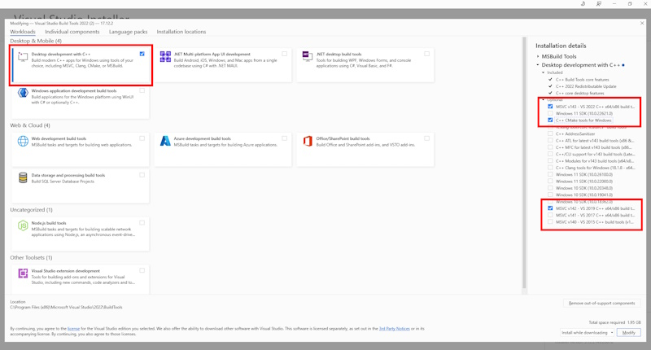

# OpenVINO&trade; Model Server Developer Guide for Windows (Experimental/Alpha) {#ovms_docs_windows_developer_guide}
This document describes experimental/alpha windows development and compilation guide for ovms.exe binary.

OpenVINO&trade; Model Server is in experimental/alpha stage of windows enabling with limited functionality and quality.
It is recommended to use the top of main repository branch for more feature enabled code and better software quality for windows.

## List of enabled features:
### Limited model server basic functionality besides disabled features
### GRPC API
### Mediapipe graphs execution
### Serving single models in all formats

## List of disabled features:
### Ovms feature parity with Linux implementation
### LLM support
### PYTHON NODES support
### REST API support
### Custom nodes support
### Cloud storage support
### Model cache support
### DAG pipelines

# Install prerequisites

## Power shell settings
Set Execution Policy to RemoteSigned
Open PowerShell as an administrator: Right-click on the Start button and select “Windows PowerShell (Admin)”.
Run the command:
```Set-ExecutionPolicy RemoteSigned```
Confirm the change by typing “A” and pressing Enter.

## VISUAL BUILD TOOLS
Install build tools for VS:

https://aka.ms/vs/17/release/vs_BuildTools.exe

Mark required options for installation:
- C++ Desktop development with C++
- Windows 11 SDK
- MSVC v143 CPP - VS 2022 C++ platform toolset.
- C++ CMake tools for Windows platform toolset.
- MSVC v142 CPP - VS 2022 C++ platform toolset.



## Power shell settings
Set Execution Policy to RemoteSigned
Open PowerShell as an administrator: Right-click on the Start button and select “Windows PowerShell (Admin)”.
Run the command:
```Set-ExecutionPolicy Unrestricted -Scope CurrentUser -Force```
Confirm the change by typing “A” and pressing Enter.

## Enable Developer mode in windows system settings
Follow instructions in the link below:
https://learn.microsoft.com/en-us/windows/apps/get-started/enable-your-device-for-development

## Run Developer Command Prompt for VS 2022
Press Start and paste "Developer Command Prompt for VS 2022" to run cmd.exe for VS C++ developers
Run commands in this prompt is not stated otherwise.

## PYTHON: https://www.python.org/ftp/python/3.9.0/python-3.9.0-amd64.exe in C:\opt\Python39
make sure you install numpy for the python version you pass as build argument
make sure default "python --version" gets you 3.9 by setting:
```
set PATH=C:\opt\Python39\;C:\opt\Python39\Scripts\;%PATH%
python --version
pip install numpy==1.23
```

# Building without proxy
Please set the proxy setting for windows for in environment variables when building behind proxy
```
set HTTP_PROXY=
set HTTPS_PROXY=
```
Also remove proxy from your .gitconfig

## Building with proxy
Please set the proxy setting for windows for in environment variables when building behind proxy
```
set HTTP_PROXY=my.proxy.com:123
set HTTPS_PROXY=my.proxy.com:122
```

## NPM YARN
Download and run the nvm installer.
https://github.com/coreybutler/nvm-windows/releases/download/1.1.12/nvm-setup.exe
After installation run below commands,
Run in command line:
```
nvm install 22.9.0
nvm use 22.9.0
npm cache clean --force
```

If you want to compile without proxy, npm proxy needs to be reset:
```
set http_proxy=
set https_proxy=
npm config rm https-proxy
npm config rm proxy
npm i --global yarn
yarn
```

## GET CODE
```
md C:\git
cd C:\git\
git clone https://github.com/openvinotoolkit/model_server.git
cd model_server
```

## Install dependencies
Run windows_install_dependencies.bat
```
windows_install_dependencies.bat
```

## COMPILE

# Export BAZEL env variables:
Set the variables to make sure bash is visible and add its directory in PATH - C:\opt\msys64\usr\bin:
```
set PATH=%PATH%;C:\opt\msys64\usr\bin;c:\opt
set BAZEL_SH=C:\opt\msys64\usr\bin\bash.exe
```

# MSVC compiler settings
```
set BAZEL_VS=C:\Program Files (x86)\Microsoft Visual Studio\2022\BuildTools
set BAZEL_VC=C:\Program Files (x86)\Microsoft Visual Studio\2022\BuildTools\VC
set BAZEL_VC_FULL_VERSION=14.29.30133
```

# Run bazel build command
```
bazel --output_user_root=C:/b_tmp build --config=windows --jobs=%NUMBER_OF_PROCESSORS% --subcommands --verbose_failures //src:ovms 2>&1 | tee compilation.log
```

# Set python paths
```
set "setPythonPath=%cd%\bazel-out\x64_windows-opt\bin\src\python\binding"
set "PYTHONPATH=%setPythonPath%"
```

## You can setup environment variables for fresh start of Developer command line
For buildigng and running ovms.exe after the windows_install_dependencies.bat was successful run the batch script in new "Developer Command Prompt for VS 2022":
```
windows_setupvars.bat
```

## DEPLOY
Open cmd.exe in c:\opt
```
md test\model\1
xcopy /r /Y C:\git\model_server\bazel-out\x64_windows-opt\bin\src\ovms.exe c:\opt\test
c:\opt\openvino\setupvars.bat
C:\opt\opencv\setup_vars_opencv4.cmd
cd c:\opt\test
wget https://www.kaggle.com/api/v1/models/tensorflow/faster-rcnn-resnet-v1/tensorFlow2/faster-rcnn-resnet50-v1-640x640/1/download -O 1.tar.gz
tar xzf 1.tar.gz -C model\1
```

## Start server
```
ovms.exe --model_name faster_rcnn --model_path model --port 9000
```

## Prepare client
Open second cmd.exe terminal
```
cd c:\opt && md client && cd client
wget https://raw.githubusercontent.com/openvinotoolkit/model_server/main/demos/object_detection/python/object_detection.py
wget https://raw.githubusercontent.com/openvinotoolkit/model_server/main/demos/object_detection/python/requirements.txt
wget https://raw.githubusercontent.com/openvinotoolkit/open_model_zoo/master/data/dataset_classes/coco_91cl.txt
wget https://storage.openvinotoolkit.org/repositories/openvino_notebooks/data/data/image/coco_bike.jpg

pip install --upgrade pip
pip install -r requirements.txt
pip install numpy==1.23
python object_detection.py --image coco_bike.jpg --output output.jpg --service_url localhost:9000
```

# OpenVINO&trade; Model Server VS Code setup on Windows 11
Install VS Code and c/c++ Extension

Copy vscode/launch.json, vscode/tasks.json to .vscode directory.

## Example launch.json
```
{
    "version": "0.2.0",
    "configurations": [
        {
            "name" : "OVMS RLS",
            "type": "cppvsdbg",
            "request": "launch",
            "program": "${workspaceFolder}/bazel-out/x64_windows-opt/bin/src/ovms.exe",
            "args": ["--help"],
            "cwd": "${workspaceFolder}/bazel-out/x64_windows-opt/bin/src/",
            "environment": [
                {"name": "PATH", "value": "%PATH%;C:\\opt\\intel\\openvino_2024\\runtime\\bin\\intel64\\Release;C:\\Windows\\SysWOW64\\;C:\\opt\\intel\\openvino_2024\\runtime\\3rdparty\\tbb\\bin\\;C:\\Program Files (x86)\\Microsoft Visual Studio\\2019\\Professional\\VC\\Redist\\MSVC\\14.29.30133\\debug_nonredist\\x64\\Microsoft.VC142.DebugCRT\\"},
            ],
            "externalConsole": true,
            "logging": {
                "moduleLoad": false,
                "trace": true
            },
            "sourceFileMap": {
                "/c/users/rasapala/_bazel_rasapala/tpoq5oxa/execroot/ovms/": "${workspaceFolder}"
            }
        },
        {
            "name" : "OVMS DEBG",
            "type": "cppvsdbg",
            "request": "launch",
            "program": "${workspaceFolder}/bazel-out/x64_windows-dbg/bin/src/ovms.exe",
            "args": ["--help"],
            "cwd": "${workspaceFolder}/bazel-out/x64_windows-dbg/bin/src/",
            "environment": [
                {"name": "PATH", "value": "%PATH%;C:\\opt\\intel\\openvino_2024\\runtime\\bin\\intel64\\Release;C:\\Windows\\SysWOW64\\;C:\\opt\\intel\\openvino_2024\\runtime\\3rdparty\\tbb\\bin\\;C:\\Program Files (x86)\\Microsoft Visual Studio\\2019\\Professional\\VC\\Redist\\MSVC\\14.29.30133\\debug_nonredist\\x64\\Microsoft.VC142.DebugCRT\\"},
            ],
            "externalConsole": true,
            "logging": {
                "moduleLoad": false,
                "trace": true
            },
            "sourceFileMap": {
                "/c/users/rasapala/_bazel_rasapala/tpoq5oxa/execroot/ovms/": "${workspaceFolder}"
            }
        }
    ]
}
```

## Example tasks.json
```
{
    "version": "2.0.0",
    "tasks": [
        {
            "label": "Build (Debug)",
            "type": "shell",
            "command": "bazel build -c dbg --config=windows --jobs=24 --subcommands --verbose_failures //src:ovms",
            "group": {
                "kind": "build",
                "isDefault": true
            },
        },
        {
            "label": "Build (Release)",
            "type": "shell",
            "command": "bazel build -c opt --config=windows --jobs=24 --subcommands --verbose_failures //src:ovms",
            "group": {
                "kind": "build",
                "isDefault": true
            },
        }
    ]
}
```

## Build
Ctrl + Shift + B
Choose Build (Debug) or Build (Release) in the task dropdown.

## Debug
Press "OVMS DEBUG(model_server)" at the bottom left task bar in visual code.
or
Press "OVMS RELEASE(model_server)" at the bottom left task bar in visual code.

Breakpoints are available after building the Debug solution and choosing OVMS Debug task.

## Running unit tests
```
bazel --output_user_root=C:/b_tmp build --config=windows --jobs=%NUMBER_OF_PROCESSORS% --subcommands --verbose_failures //src:ovms_test 2>&1 | tee compilation.log
c:\opt\openvino\setupvars.bat
C:\opt\opencv\setup_vars_opencv4.cmd
windows_change_test_configs.py
bazel-bin\src\ovms_test.exe --gtest_filter=* 2>&1 | tee win_full_test.log
```
