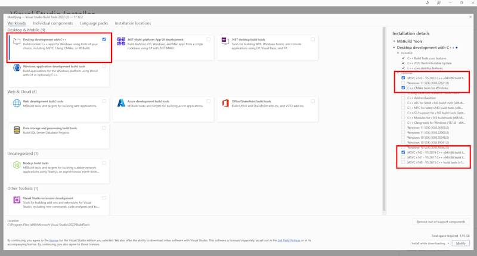

# OpenVINO&trade; Model Server Developer Guide for Windows
This document describes windows development and compilation guide for ovms.exe binary.
This instruction was tested on Windows 11 and Windows 10 OS.

## List of disabled features on Windows model server:
- cloud storage for the models - to be added in next releases
- C-API interface - to be added in next releases
- DAG pipelines - legacy feature


# Install prerequisites
Following the steps below requires 40GB of free disk space.

## VISUAL BUILD TOOLS
Install build tools for VS:

https://aka.ms/vs/17/release/vs_BuildTools.exe

Mark required options for installation:
- C++ Desktop development with C++
- Windows 11 SDK (10.0.26210.0)
- MSVC v143 CPP - VS 2022 C++ platform toolset.
- C++ CMake tools for Windows platform toolset.
- MSVC v142 CPP - VS 2022 C++ platform toolset.
- Optional Windows 11 SDK (10.0.26100.0) for Windows 10 compilation



## Power shell settings
Set Execution Policy to RemoteSigned
Open PowerShell as an administrator: Right-click on the Start button and select “Windows PowerShell (Admin)”.
Run the command:
```Set-ExecutionPolicy Unrestricted -Scope CurrentUser -Force```

## Enable Developer mode in windows system settings
Follow instructions in the link below:
https://learn.microsoft.com/en-us/windows/apps/get-started/enable-your-device-for-development

## Run Command Prompt
Press Windows Start and run the cmd.exe terminal as Administrator.
Run commands in this prompt is not stated otherwise.

## Pull OpenVINO Model Server source
> `Git` is required to complete this step. If you don't have it on your system, download it from https://git-scm.com/downloads/win and install before you continue.
Run below commands in terminal to clone model server repository:
```bat
mkdir C:\git
cd C:\git\
git clone https://github.com/openvinotoolkit/model_server.git
cd model_server
```

## Install dependencies
Run windows_install_build_dependencies.bat
This will install around 6 GB dependencies in the c:\opt directory:
- wet.exe, msys2 tools, Openvinotoolkit for GenAI, OpenCL headers, BoringSSL, bazel, Python 3.12.10, OpenCV, Curl

If error occurs during the script execution, please fix the error and rerun the script.
```bat
windows_install_build_dependencies.bat
```

Optionally, you add parameter to the windows_install_build_dependencies.bat script
```bat
windows_install_build_dependencies.bat my_dir_on_c 1 1
```
[arg1] - This way you can change default dependency install directory to c:\my_dir_on_c
[arg2] - Set the clean flag to 0 or 1 - this will cleanup the installation directories and reinstall all dependencies
[arg3] - Add the compilation integrity flag to 0 or 1 - set the additional integritycheck and Qspectre compilation flag when compiling dependencies

## COMPILE
[WARNING] This step consumes up to 13GB of disk space. It can take up to 1h depending on host CPU and internet connection speed.
This default command compiles ovms.exe without python dependencies, just C++ binary with limited support for chat template processing.
```bat
windows_build.bat
```

Optionally, you add parameters to the windows_build.bat script
```bat
windows_build.bat my_dir_on_c --with_python 3.13.1 --with_tests --integrity
```
[arg1] This way you can change default dependency location directory to c:\my_dir_on_c
[arg2] --with_python - this will build the ovms.exe with python dependency and support for python chat templates for GENAI LLM
[arg3] additional Python version (e.g. `3.13.1`) - builds a second set of Python runtime libraries (`libovmspython`, `libpython_calculators`, `pyovms`) linked against the specified Python ABI, on top of the default Python 3.12 ABI. This enables serving Python nodes from virtualenvs created with that Python version. Requires a full Python development install (with headers and `pythonXYZ.dll`) at `C:\opt\Python<MAJOR><MINOR>` (e.g. `C:\opt\Python313`).
[arg4] --with_tests - this will also build ovms_test.exe target
[arg5] --integrity - set the additional integritycheck compilation flag

> **Note:** When arg5 is provided, the build performs three Bazel invocations: the main build (cp312 default), the extra-ABI build (e.g. cp313), and a restore build that returns the bazel-bin artifacts to cp312 linkage so that packaging picks up the correct default DLLs.

The staged extra-ABI libraries are placed in `dist\windows\python_abi_addons\cp<tag>\` and are automatically picked up by `windows_create_package.bat --with_python`.

# Running unit tests - optional
The script compiles ovms_test binary with C++ only, downloads and converts test LLM models (src\tests\llm_testing).
```bat
windows_test.bat
```

The optional script compiles ovms_test binary with python support, downloads and converts test LLM models (src\tests\llm_testing) and installs Python torch and optimum.
```bat
windows_test.bat opt --with_python 3.13.1
```
[arg1] This way you can change default dependency location directory to c:\my_dir_on_c
[arg2] --with_python - compile and run tests with Python support
[arg3] optional additional Python ABI version (e.g. `3.13.1`) - sets `OVMS_PYTHON_ABI` so the Python runtime tests exercise the versioned loader path (cp313 DLLs). Requires the dev Python install at `C:\opt\Python313`.
[arg4] optional gtest filter (default `*`)

# Creating deployment package
This step prepares ovms.zip deployment package from the build artifacts in the dist\windows\ directory. Run this script after successful compilation.
The default version creates C++ only version without Python dependency.
```bat
windows_create_package.bat
```

Optionally you can create a package with Python dependency. Note that to create a valid package with Python, you need to build using the `--with_python` flag in the previous step as well.
```bat
windows_create_package.bat opt --with_python
```

The package includes the default Python 3.12 embedded runtime and its libraries:
- `libovmspython.dll` / `libovmspython-cp312.dll` — Python runtime loader (cp312 fallback / cp312 explicit)
- `libpython_calculators.dll` / `libpython_calculators-cp312.dll` — MediaPipe Python calculator plugin
- `python\pyovms.pyd` and `python\cp312\pyovms.pyd` — Python binding module

If arg5 was passed to `windows_build.bat` (e.g. `3.13.1`), the additional ABI libraries are also included:
- `libovmspython-cp313.dll`, `libpython_calculators-cp313.dll`
- `python\cp313\pyovms.pyd`

**Selecting the active Python ABI at runtime:** `ovms.exe` detects the ABI from the `PYTHONHOME` environment variable. When started via `setupvars.bat`, `PYTHONHOME` points to the bundled `python\` directory (no version digits), so the unversioned fallback DLLs are used (cp312). To use a different ABI — e.g. when serving Python nodes from a cp313 virtualenv — set the environment before starting `ovms.exe`:
```bat
set PYTHONHOME=C:\Program Files\Python313
set PYTHONPATH=<path_to_venv>\Lib\site-packages;<ovms_dir>\python\cp313
```
Or use the explicit override to bypass auto-detection:
```bat
set OVMS_PYTHON_ABI=313
```

# Test the Deployment
You can follow the [baremetal deployment guide](deploying_server_baremetal.md) for information how to deploy and use the ovms.zip package.

# Developer Command Prompt
For building ovms.exe and running ovms_test.exe with manual bazel commands you must setup proper environment variables.
Run the batch script in new "Developer Command Prompt for VS 2022" terminal:
```bat
cd c:\git\model_server
windows_setupvars.bat
```

Rebuild unit tests:
```bat
bazel --output_user_root=c:\opt build --config=windows --action_env OpenVINO_DIR=c:\opt\genai/runtime/cmake --jobs=%NUMBER_OF_PROCESSORS% --verbose_failures //src:ovms_test 2>&1 | tee win_build_test.log
```

Download LLMs
```bat
%cd%\windows_prepare_llm_models.bat %cd%\src\test\llm_testing
```

Change tests configs to windows:
```bat
python windows_change_test_configs.py
```

Run specific unit tests by setting gtest_filter:
```bat
%cd%\bazel-bin\src\ovms_test.exe --gtest_filter=* 2>&1 | tee win_full_test.log
```
