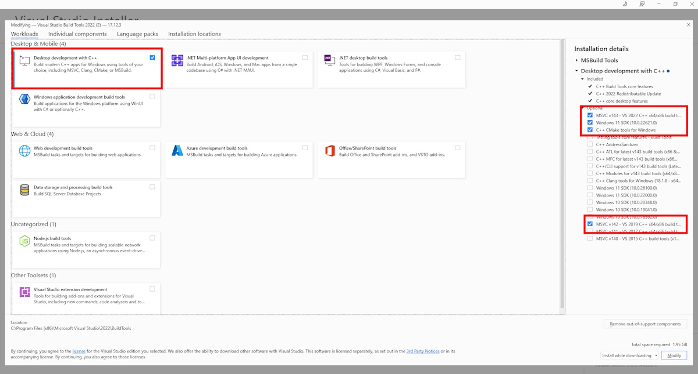

# OpenVINO&trade; Model Server Developer Guide for Windows
This document describes windows development and compilation guide for ovms.exe binary.
This instruction was tested on Windows 11 and Windows 10 OS.

## List of disabled features on Windows model server:
- cloud storage for the models - to be added in next releases
- C-API interface - to be added in next releases
- DAG pipelines - legacy feature


# Install prerequisites
Following the steps below requires 40GB of free disk space.

## VISUAL BUILD TOOLS
Install build tools for VS:

https://aka.ms/vs/17/release/vs_BuildTools.exe

Mark required options for installation:
- C++ Desktop development with C++
- Windows 11 SDK (10.0.26210.0)
- MSVC v143 CPP - VS 2022 C++ platform toolset.
- C++ CMake tools for Windows platform toolset.
- MSVC v142 CPP - VS 2022 C++ platform toolset.
- Optional Windows 11 SDK (10.0.26100.0) for Windows 10 compilation



## Power shell settings
Set Execution Policy to RemoteSigned
Open PowerShell as an administrator: Right-click on the Start button and select “Windows PowerShell (Admin)”.
Run the command:
```Set-ExecutionPolicy Unrestricted -Scope CurrentUser -Force```

## Enable Developer mode in windows system settings
Follow instructions in the link below:
https://learn.microsoft.com/en-us/windows/apps/get-started/enable-your-device-for-development

## Run Command Prompt
Press Windows Start and run the cmd.exe terminal as Administrator.
Run commands in this prompt is not stated otherwise.

## Pull OpenVINO Model Server source
> `Git` is required to complete this step. If you don't have it on your system, download it from https://git-scm.com/downloads/win and install before you continue.
Run below commands in terminal to clone model server repository:
```bat
mkdir C:\git
cd C:\git\
git clone https://github.com/openvinotoolkit/model_server.git
cd model_server
```

## Install dependencies
Run windows_install_build_dependencies.bat
This will install around 6 GB dependencies in the c:\opt directory:
- wet.exe, msys2 tools, Openvinotoolkit for Genai, OpenCL headers, BoringSSL, bazel, Python 3.12.9, OpenCV, Go, Git-lfs, Curl

If error occurs during the script execution, please fix the error and rerun the script.
```bat
windows_install_build_dependencies.bat
```

## COMPILE
[WARNING] This step consumes 13GB of disk space. It can take up to 1h depending on host CPU and internet connection speed.
This default command compiles ovms.exe without python dependencies, just C++ binary with C++ chat templates GENAI LLM support.
```bat
windows_build.bat
```

Optionally you can build ovms.exe with python dependency that allows to use python chat templates for GENAI LLM support.
```bat
windows_build.bat opt --with_python
```
# Running unit tests - optional
The script compiles ovms_test binary with C++ only version, downloads and converts test LLM models (src\tests\llm_testing).
```bat
windows_test.bat
```

The optional script compiles ovms_test binary with python support, downloads and converts test LLM models (src\tests\llm_testing) and installs Python torch and optimum.
```bat
windows_test.bat opt --with_python
```

# Creating deployment package
This step prepares ovms.zip deployment package from the build artifacts in the dist\windows\ directory. Run this script after successful compilation.
The default version creates C++ only version without Python dependency.
```bat
windows_create_package.bat
```

Optionally you can create a package with Python dependency. Note that to create valid package with Python, you need to build using `--with_pathon` flag in the previous step as well.
```bat
windows_create_package.bat opt --with_python
```

# Test the Deployment
You can follow the [baremetal deployment guide](deploying_server_baremetal.md) for information how to deploy and use the ovms.zip package.

# Developer Command Prompt
For building ovms.exe and running ovms_test.exe with manual bazel commands you must setup proper environment variables.
Run the batch script in new "Developer Command Prompt for VS 2022" terminal:
```bat
cd c:\git\model_server
windows_setupvars.bat
```

Rebuild unit tests:
```bat
bazel --output_user_root=c:\opt build --config=windows --action_env OpenVINO_DIR=c:\opt\genai/runtime/cmake --jobs=%NUMBER_OF_PROCESSORS% --verbose_failures //src:ovms_test 2>&1 | tee win_build_test.log
```

Download LLMs
```bat
%cd%\windows_prepare_llm_models.bat %cd%\src\test\llm_testing
```

Change tests configs to windows:
```bat
python windows_change_test_configs.py
```

Run specific unit tests by setting gtest_filter:
```bat
%cd%\bazel-bin\src\ovms_test.exe --gtest_filter=* 2>&1 | tee win_full_test.log
```