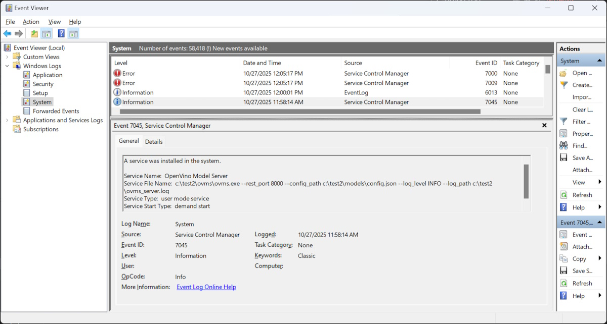

# OpenVINO Model Server as service on Windows {#ovms_docs_deploying_server_service}

This document describes installation and usage of OpenVINO Model Server as a service on Windows

## Install OpenVINO Model Server

Follow [deployment instructions](deploying_server_baremetal.md) for Windows OS.

## Install the service

```bat
mkdir c:\models
install_ovms_service.bat c:\models
sc start ovms
```
Change the script parameter with model repository path if needed

During the installation, model repository path will be set in environment variable OVMS_MODEL_REPOSITORY_PATH, which defines default parameters for ovms CLI to interact with the service.

Optionally you can change the default service parameters like below:
```text
sc start ovms --rest_port 8000 --config_path c:\models\config.json --log_level DEBUG --log_path c:\tmp\ovms_server.log
```

## Start the service
```bat
sc start ovms
```

## Stop the service
```bat
sc stop ovms
```

## Delete the service
```bat
sc delete ovms
```

## Interaction with the service

### List models pulled in the model repository
```bat
ovms --list_models
```

### Pull models
```bat
ovms --pull --model_name OpenVINO/Qwen3-8B-int4-ov --task text_generation --target_device
```

### Start a model by adding it to the config.json
```bat
ovms --add_to_config --model_name OpenVINO/Qwen3-8B-int4-ov
```

### Stop a model by removing it from the config.json
```bat
ovms --remove_from_config --model_name OpenVINO/Qwen3-8B-int4-ov
```

### Check served models 
```bat
curl http://localhost:8000/v3/models
```
### Check models configured for serving
```bat
type %OVMS_MODEL_REPOSITORY_PATH%\config.json
```


## Service status gui
You can monitor the service status gui in the native services windows application.
Start it by writing services in the windows start search bar.


## Service registry settings
You can monitor the service settings in the native windows registry editor application.
Start it by writing regedit in the windows start search bar.
The service settings after installation are available at the `Computer\HKEY_LOCAL_MACHINE\SYSTEM\CurrentControlSet\Services\ovms` path:


## Service log and events
You can monitor the service log with the --log_level [INFO,DEBUG,TRACE] option during the service creation and the --log_path path_to_file parameter. By default, it will be saved in the ovms installation folder.

Additionally you can review the service events and errors in the native windows event viewer application.
Start it by writing event viewer in the windows start search bar.
The service events are visible in the `Windows Logs -> System` tab.

