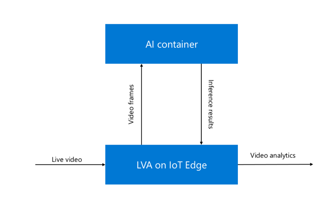

# Inference Server for Azure Media Services 

OpenVINO™ Model Server for Azure Live Video Analytics (LVA) is an AI Extension used with LVA on 
IoT Edge devices. It enables easy delegation of inference requests to OpenVINO in media analytics pipelines. 

The integration model is depicted below:


OpenVINO Model Server is running as a docker container and exposes an LVA REST API interface for 
the pipeline applications. This interface supports a range of model categories and returns json response 
including model metadata like attribute, labels or classes names. 

Beside LVA REST API, the Inference Server expose also the complete OpenVINO Model Server REST and gRPC API,
 which could be used with arbitrary OpenVINO model. 

## LVA REST API

HTTP contract is defined as follows:
* OpenVINO Model Server acts as the HTTP server 
* LVA acts as the HTTP client


| POST        | http://hostname/<endpoint_name> |
| ------------- |-------------|
| Accept      | application/json, */* |
| Authorization     | None |
| Content-Type | image/jpeg <br> image/png <br>  image/bmp |
|User-Agent|Azure Media Services|
|Body |Image bytes, binary encoded in one of the supported content types |

Example:

```bash
POST http://localhost:5000/vehicle-detection HTTP/1.1
Host: localhost:5000
x-ms-client-request-id: d6050cd4-c9f2-42d3-9adc-53ba7e440f17
Content-Type: image/bmp
Content-Length: 519222

(Image Binary Content)

```

*Note:* Depending on the model configuration, input image resolution needs to match the model expected size or
it will be resized automatically. 

Response:

|Response||
| ------------- |-------------|
| Status code | 200 OK - Inference results found <br>204 No Content - No content found by the AI <br> 400 Bad Request - Not expected <br> 500 Internal Server Error - Not expected <br> 503 Server Busy - AMS will back-off based on “Retry-After” header or based on a default amount of time in case header not preset.|
| Content-Type     | application/json|
| Content-Length | Body length, in bytes |
| Body | JSON object with single “inferences” property. |


## Supported models categories

Models configured in OpenVINO Model Server for LVA need to belong to one of defined categories. 
The category defines what kind of data is in the model response and in what format. 
See the category characteristics below to learn more about their requirements. 
Each model needs to have an associated config file, which describes the included classes, 
attributes and labels. The config can also specify input data – like resolution or pre-processing parameters. 


### Object detection

In this category, models should return response in the shape `[1, 1, N, 7]` where N is the number of detected bounding boxes.
For each detection, the description has the 
format: [image_id, label, conf, x_min, y_min, x_max, y_max], where:
- image_id - ID of the image in the batch
- label - predicted class ID
- conf - confidence for the predicted class
- (x_min, y_min) - coordinates of the top left bounding box corner
- (x_max, y_max) - coordinates of the bottom right bounding box corner.

There are several Object Detection models available in the [OpenVINO Model Zoo](https://docs.openvinotoolkit.org/2020.2/_models_intel_index.html). 
The Inference Server Docker image comes pre-built with the following Object Detection models: 

* vehicle-detection - [vehicle-detection-adas-binary-0001](https://github.com/opencv/open_model_zoo/tree/master/models/intel/vehicle-detection-adas-binary-0001)
* face-detection - [face-detection-adas-0001](https://github.com/opencv/open_model_zoo/tree/master/models/intel/face-detection-adas-binary-0001)
* person-vehicle-bike-detection-crossroad - [person-vehicle-bike-detection-crossroad-0078](http://•%09https:/github.com/opencv/open_model_zoo/tree/master/models/intel/person-vehicle-bike-detection-crossroad-0078)

Each model should include also a configuration file in json format. Example of such
configuration file is [here](ams_models/vehicle_detection_adas_model.json)

Below is a sample of the model output:
```json
{
   "subtype" : "vehicleDetection",
   "entities" : [
      {
         "box" : {
            "h" : 0.10686594247818,
            "t" : 0.336242735385895,
            "w" : 0.130945563316345,
            "l" : 0.789495408535004
         },
         "tag" : {
            "confidence" : 0.999798119068146,
            "value" : "vehicle"
         }
      },
      {
         "box" : {
            "h" : 0.143958985805511,
            "l" : 0.640124976634979,
            "t" : 0.308264225721359,
            "w" : 0.159151077270508
         },
         "tag" : {
            "value" : "vehicle",
            "confidence" : 0.572816431522369
         }
      },
    ],
   "type" : "entity"
}
```

### Classification models

Classification models, in this category, give the results in softmax layer. This include a set
of probabilities in classes defined for the model.
Each output of the model should have the shape `[1, C , ...]`. First dimension represent the batch size,
which should be set to 1. `C` represent all classes defined in the model. Remaining dimensions 
are ignored (if present, first index is used).

Examples of such models are available in the [OpenVINO Model Zoo](https://docs.openvinotoolkit.org/2020.2/_models_intel_index.html).
In OVMS docker image for LVA is included the following classification model: 
* vehicle-attributes-recognition - [vehicle-attributes-recognition-barrier-0039](https://github.com/opencv/open_model_zoo/tree/master/models/intel/vehicle-attributes-recognition-barrier-0039)

Model includes a configuration file in json format. See an example configuration file [here](../ams_models/vehicle_attributes_model.json)

Below is a sample of such model:
```json
{
   "subtype" : "vehicleClassification",
   "type" : "classification",
   "classifications" : [
{
        "attributes" : [
	{
		"confidence": 0.589816808700562, 
		"name": "color",
		 "value": "red"
	},
 	{
		"confidence": 0.289313167333603,
		 "name": "color",
		 "value": "white"
	},
 	{
		"confidence": 0.0435199774801731, 
		"name": "color", 
		"value": "gray"
	},
 	{
		"confidence": 0.0417489744722843, 
		"name": "color", 
		"value": "blue"
	},
 	{
		"confidence": 0.0278004333376884, 
		"name": "color", 
		"value": "black"
	},
 	{
		"confidence": 0.00414687860757113,
		 "name": "color", 
		"value": "green"
	},
 	{
		"confidence": 0.00365369999781251,
		 "name": "color",
		 "value": "yellow"
	}
]
      },
      {
         "attributes" : [
            {
               "name" : "type",
               "confidence" : 0.00293471338227391,
               "value" : "car"
            },
            {
               "name" : "type",
               "value" : "van",
               "confidence" : 0.000757944362703711
            },
            {
               "confidence" : 0.996138155460358,
               "value" : "truck",
               "name" : "type"
            },
            {
               "name" : "type",
               "confidence" : 0.000169166218256578,
               "value" : "bus"
            }
         ]
      }
   ]
}
```

## Deployment and configuration of OpenVINO Inference Server for LVA    

OpenVINO Inference Server for LVA includes two components which require proper configuration.
* OpenVINO Model Server - serves all models and executes inference operation
* LVA REST API wrapper - translates LVA API, run pre and post processing operations, communicates with OVMS via localhost and gRPC interface.

OpenVINO Model server requires file `/opt/ams_models/ovms_config.json` which is by default configured
to use [4 exemplary models](../ams_models/ovms_config.json).

LVA REST API wrapper requires model configuration files describing all enabled models.
Models config files should be present in `/opt/ams_models/` folder. Model configuration files should have _model.json suffix.
They include the mapping between ovms models from `ovms_config.json` and LVA REST API endpoint name.

Model files in OpenVINO Intermediate Representation format should be stored in the folders structure
like defined on [OVMS documentation](../../docs/docker_container.md#preparing-the-models).

Note: OVMS for LVA was tested for the models included in the docker image. 
It should be possible to swap the models if they have correspondent format and content of the inputs and outputs. 
It is, however, not officially supported. 

## Target device selection for models: 

By default, the OpenVINO Model Server for LVA is started, serving included models, using CPU as the target device executing the inference requests. 
Besides CPU, OVMS for LVA is currently supporting 
[Myriad Plugin](https://docs.openvinotoolkit.org/latest/_docs_IE_DG_supported_plugins_MYRIAD.html) 
and [Heterogeneous Plugin](https://docs.openvinotoolkit.org/latest/_docs_IE_DG_supported_plugins_HETERO.html). 

It is possible to set the target device for each individual model by setting additional environment variable 
OVMS_MODEL_DEVICES, or passing –ovms_model_devices parameter to OVMS for LVA, with a semicolon separated list of models with assigned target devices. 
Below is an example: 
OVMS_MODEL_DEVICES='vehicle_detection_adas=CPU;vehicle_attributes=MYRIAD' 

## Starting docker container

# OpenVINO Inference Server for LVA parameters
 

OpenVINO Model Server for LVA is started vi a command `/ams_wrapper/start_ams.py`. It accepts the following parameters:

```

  --ams_port AMS_PORT   Port for AMS Service to listen on (default: 5000)

  --ovms_port OVMS_PORT

                        Port for OVMS to listen on (default: 9000)

  --workers WORKERS     AMS service workers (default: 20)

  --grpc_workers GRPC_WORKERS

                        OVMS service workers (default: 10)

  --ovms_model_devices OVMS_MODEL_DEVICES

                        Colon delimited list of model devices, in following

                        format: '<model_1_name>=<device_name>;<model_2_name>=<

                        device_name>'

```
Docker container can be initiated via a command:
```bash
docker run <image_name> /ams_wrapper/start_ams.py
```

## Performance tuning
OVMS component is configured for most generic manner to work well in low and high spec resources. 
In case there is a need to adjust the performance parameters, it can be done by replacing ovms_config.json 
file in a custom docker image or mounting it from a local storage. In that case follow the recommendation 
for [OVMS](../../docs/performance_tuning.md) and [OpenVINO plugins](https://docs.openvinotoolkit.org/latest/_docs_IE_DG_supported_plugins_Supported_Devices.html).  

## Building docker image

The image in Azure Marketplance is built using the make target:

`make docker_build_ams_clearlinux` – clearlinux base image with Opensource version of OpenVINO 


It is also possible to build the image on centos base using the command below. It requires the OpenVINO toolkit binary
package url which can be received after user [registration](https://software.intel.com/content/www/us/en/develop/tools/openvino-toolkit/choose-download/linux.html)

`make docker_build_ams DLDT_PACKAGE_URL= <url to binary OV package>` - centos base image with a binary OV package 


## Testing

Run all functional tests 

`make ams_test` 


Test response from the deployed component:
 

`curl -X POST -H "Content-Type: image/jpg" --data-binary @test_image.jpg localhost:5000/vehicleDetection | jq `
