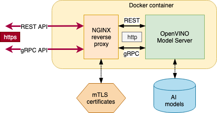

# Securing Model Server with NGINX {#ovms_extras_nginx-mtls-auth-readme}

Clone the OpenVINO Model Server repository and enter the NGINX directory:
```bash
git clone https://github.com/openvinotoolkit/model_server.git
cd model_server/extras/nginx-mtls-auth
```

The Dockerfile and scripts in this directory provide an example of using NGINX mTLS module to implement authentication and authorization of OpenVINO Model Server.

This can secure both GRPC and REST endpoints. Model Server will present server certificate, and allow connection only from clients who perform full TLS handshake (successful client certificate authentication), as described in [RFC 2246](https://www.ietf.org/rfc/rfc2246.txt).

WARNING: Those contain certificate generation automation for development and testing purposes. Do not use those in production - follow best practices of your organization. For ensuring "fast fail", certificates generated here will expire after a single day.

WARNING: Review the NGINX configuration settings and adjust them according to your organization policies: you are responsible for setting and using a secure configuration.

WARNING: Please follow [security considerations for containers](../../docs/security_considerations.md).





## Quick Start

1. Ensure you have `openvino/model_server` image available. This could be one from official releases or a local one.

```bash
docker pull openvino/model_server:latest
```

2. Run `./build.sh` to build NGINX image extra layer.

```bash
./build.sh
```

3. Run `./generate_certs.sh`  script. It will generate self-signed certificates (for testing only - follow your organization process for requesting and generating the server and client certificates).

```bash
./generate_certs.sh
```

3. In terminal 1, execute `./start_secure_model_server.sh` script. It will download sample model and start the container.

```bash
./start_secure_model_server.sh
```

4. In terminal 2, execute `./test_grpc.sh` or `./test_rest.sh`. Those will try to connect to mentioned above container and use our example python client to test the system.

```bash
./test_grpc.sh
./test_rest.sh
```

NOTE: Please ensure that your proxy setting are correct, both during model download and during `docker build` operation - adjust build.sh if needed.

NOTE: When you generate the server certificate, make sure its CommonName in the certificate Subject match the DNS name of the OVMS endpoint used by the clients.

## Design

Dockerfile in this directory is building on top of existing OpenVINO Model Server image. Default result image name is `openvino/model_server:nginx-mtls`.

In this image, wrapper script is being executed by container-friendly init system (`dumb-init` was selected as an example). It is responsible for providing compatible command-line interface for Model Server CLI, while transparently exposing only encrypted endpoints.
When started, it parses command line options and adjusts both NGINX and Model Server execution parameters, then runs both processes and tracks their progress. Model Server process is running as a non-privileged user `ovms`, but initially `root` is being used to perform administrative actions.

Although `--rest_port` is an optional parameter in regular model server deployment, it is required when running with NGINX mTLS module.  Such setup exposes both gRPC and REST APIs over mTLS.

Wrapper is ensuring that model server is binding to a `loopback` interface on some random unallocated ports internally. NGINX configuration is exposing ports specified by Model Server command line arguments; it's listening on all IPv4 interfaces (`0.0.0.0`).

Wrapper will also handle NGINX -or- model server crashes, exiting container in a graceful way (if possible; another external subsystem should be responsible for restarting it).

## Reference test scripts: test_grpc.sh and test_rest.sh

Please check those to learn how to use our example python client to connect to Model Server secured by mTLS. Please check applicable python client sample file to learn how to set those in your application.


