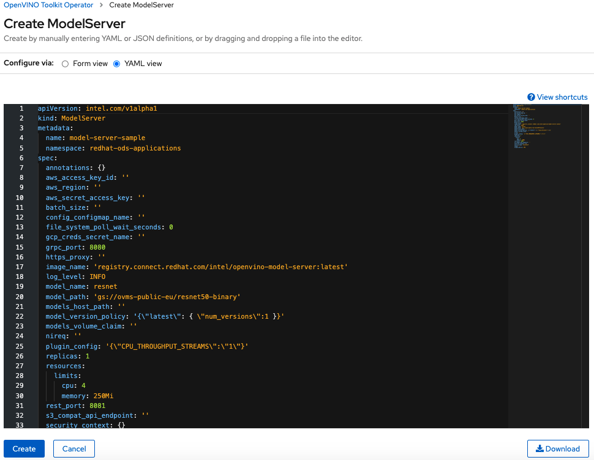
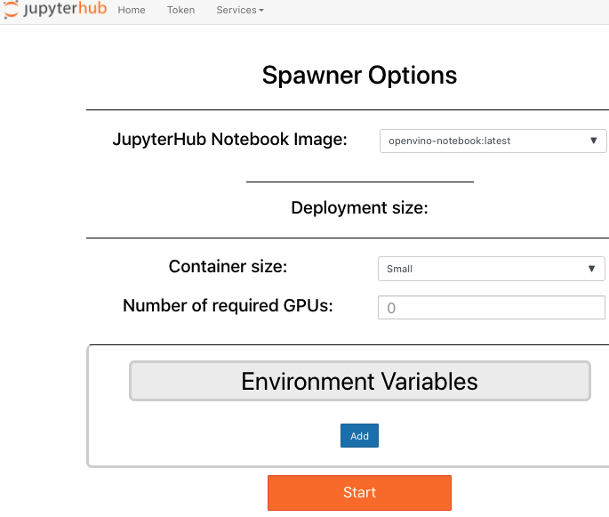

# OpenShift Operator {#ovms_extras_openvino-operator-openshift-readme}
The Operator installs and manages development tools and production AI deployments in an OpenShift cluster. It enables easy deployment and management of AI inference services by creating `ModelServer` resource.

The Operator also integrates with the JupyterHub [Spawner](https://jupyterhub.readthedocs.io/en/stable/reference/spawners.html) in [Red Hat OpenShift Data Science](https://www.redhat.com/en/technologies/cloud-computing/openshift/openshift-data-science) and [Open Data Hub](https://opendatahub.io/docs.html). See [detailed instructions](#integration-with-openshift-data-science-and-open-data-hub) below. 

## Install the Operator

In the OpenShift [web console](https://docs.openshift.com/container-platform/4.7/web_console/web-console.html) navigate to OperatorHub menu. Search for "OpenVINO" and select "OpenVINO™ Toolkit Operator". Then, click the `Install` button.

## Deploy the Operator

### From the OpenShift Console

Once you have installed the Operator in OpenShift, you can manage it using the web console. Navigate to `Installed Operators` and click `Create ModelServer` or `Create Notebook`.

#### Create a ModelServer Resource
After selecting `Create ModelServer` you will see the template for creating a deployment configuration. A few parameters will be provided by default, including the following: 
| Parameter        | Description  |
| :------------ | :----- |
| `kind` | set to `ModelServer`, which is the type of resource being deployed. 
| `name` | unique name of the [deployment](https://docs.openshift.com/online/pro/architecture/core_concepts/deployments.html), which can be modified. `model-server-sample` is provided as an example. |
| `namespace` | this will default to the current [namespace](https://docs.openshift.com/online/pro/architecture/core_concepts/projects_and_users.html#namespaces) in your cluster |
| `aws_access_key_id`, `aws_secret_access_key`, `aws_region` | optional parameters should be configured only when using [AWS S3](https://docs.aws.amazon.com/s3/index.html) storage as your AI model repository. |
| `batch_size` | by default, batch size is derived from the model. Leave blank unless you wish to modify the default. |
| `file_system_poll_wait_seconds` | time interval in seconds between checking for new versions of AI models. Setting to `0` disables automatic version updates. |
| `gcp_creds_secret_name` | optional parameter should only be configured when using [Google Cloud Storage](https://cloud.google.com/storage) as your AI model repository. The secret should be created as a [GCP credentials](https://cloud.google.com/docs/authentication/production) JSON file. |
| `grpc_port` | required parameter defines the service port for the [gRPC interface](https://github.com/openvinotoolkit/model_server/blob/v2021.4.2/docs/model_server_grpc_api.md). `8080` is the default port, but it can be modified if needed. |
| `https_proxy` | optional parameter used only when a proxy is required to download models from a remote repository. |
| `image_name` | required parameter defines container registry for the [OpenVINO Model Server](https://catalog.redhat.com/software/containers/intel/openvino-model-server/607833052937385fc98515de) image. By default `openvino-model-server:latest` is pulled, but `latest` can be replaced with a specific release version like `2021.3-gpu`. |
| `log_level` | required parameter defines the [log](https://docs.openshift.com/container-platform/4.7/logging/viewing-resource-logs.html) level. By default, the level is set to `INFO` with `ERROR` (errors only) and `DEBUG` (verbose) available as alternatives. |
| `model_name` | parameter used only when starting a `ModelServer` with a single AI model. The example provided uses `resnet` but this can be changed to describe your custom model. The parameters `config_configmap_name` and `config_path` are not used when this parameter is set. |
| `model_path` | parameter used only when starting `ModelServer` with a single AI model. For locally accessible storage, use `models_path/model_name` and for cloud storage `s3://bucket/models/model` or `gs://bucket/models/model`. For more information, see [Cloud Storage Requirements](https://github.com/openvinotoolkit/model_server/blob/v2021.4.2/docs/docker_container.md#storage). The parameters `config_configmap_name` and `config_path` are not used when this parameter is set. |
| `model_version_policy` | required parameter defines the version of AI models to serve. By default, the latest version is served. For other options, please see [Model Version Policy](https://github.com/openvinotoolkit/model_server/blob/v2021.4.2/docs/model_version_policy.md) documentation. |
| `models_volume_claim` | optional parameter should be defined only when using a persistent volume as your AI model repository. The [Persistent Volume Claim](https://docs.openshift.com/container-platform/4.7/storage/understanding-persistent-storage.html#using-pods_understanding-persistent-storage) (PVC) must be in the same namespace as this `ModelServer` resource. |
| `plugin_config` | parameter defines device plugin configuration for performance tuning. For automatic tuning, set to `{"CPU_THROUGHPUT_STREAMS":"CPU_THROUGHPUT_AUTO"}`.
| `replicas` | this required parameter defines the number of [replicas](https://docs.openshift.com/container-platform/4.7/applications/deployments/what-deployments-are.html#deployments-repliasets_what-deployments-are) for this `ModelServer` deployment. |
| `resources`, `cpu` and `memory` | optional parameter defines compute resource limits for the [node](https://docs.openshift.com/online/pro/architecture/infrastructure_components/kubernetes_infrastructure.html#node). Limit CPU cores and memory (e.g. `250Mi` for 250MB). |
| `rest_port` | required parameter defines the service port for the [REST interface](https://github.com/openvinotoolkit/model_server/blob/v2021.4.2/docs/model_server_rest_api.md). `8081` is the default port, but it can be modified if needed. |

Adjust the parameters according to your needs. See the [full list of parameters](https://github.com/openvinotoolkit/model_server/blob/v2021.4.2/deploy/#helm-options-references) in the documentation for more details. See a screenshot of the template below: 




### From the OpenShift CLI

Alternatively, after installing the Operator, you may deploy and manage deployments by creating `ModelServer` resources using the `oc` [OpenShift command line tool](https://docs.openshift.com/container-platform/4.7/cli_reference/openshift_cli/getting-started-cli.html).

Modify the [sample resource](https://github.com/openvinotoolkit/model_server/tree/v2021.4.2/extras/openvino-operator-openshift/config/samples/intel_v1alpha1_ovms.yaml) and run the following command:

```bash
oc apply -f config/samples/intel_v1alpha1_ovms.yaml
```

The available [parameters](../../deploy/README.md) are the same as above.

<b>Note</b>: Some deployment configurations have prerequisites like creating relevant resources in Kubernetes. For example, a secret with credentials,
persistent volume claim or configmap with a Model Server configuration file.

## Using ModelServer in an OpenShift Cluster

The Operator deploys a `ModelServer` instance as a Kubernetes service with a predefined number of replicas. The `Service` name will match the `ModelServer` resource. The suffix `-ovms` is added unless the phrase `ovms` is already included in the name.

```bash
oc get pods
NAME                           READY   STATUS    RESTARTS   AGE
ovms-sample-586f6f76df-dpps4   1/1     Running   0          8h

oc get services
NAME          TYPE        CLUSTER-IP       EXTERNAL-IP   PORT(S)             AGE
ovms-sample   ClusterIP   172.25.199.210   <none>        8080/TCP,8081/TCP   8h
```

The `ModelServer` service in OpenShift exposes [gRPC](../../docs/model_server_grpc_api.md) and [REST](../../docs/model_server_rest_api.md) API endpoints for processing AI inference requests.

The readiness of models for serving can be confirmed by the READY field status in the `oc get pods` output.
The endpoints can be also tested with a simple `curl` command with a request to REST API endpoints from any pod in the cluster:

```bash
curl http://<ovms_service_name>.<namespace>:8081/v1/config 
```
or
```
curl http://<ovms_service_name>.<namespace>:8081/v1/models/<model_name>/metadata
```
In the example above above, assuming namespace called `ovms`, it would be:
```bash
curl http://ovms-sample.ovms:8081/v1/config
{
"resnet" : 
{
 "model_version_status": [
  {
   "version": "1",
   "state": "AVAILABLE",
   "status": {
    "error_code": "OK",
    "error_message": "OK"
   }
  }
 ]
}

curl http://ovms-sample.ovms:8081/v1/models/resnet/metadata
{
 "modelSpec": {
  "name": "resnet",
  "signatureName": "",
  "version": "1"
 },
 "metadata": {
  "signature_def": {
   "@type": "type.googleapis.com/tensorflow.serving.SignatureDefMap",
   "signatureDef": {
    "serving_default": {
     "inputs": {
      "0": {
       "dtype": "DT_FLOAT",
       "tensorShape": {
        "dim": [
         {
          "size": "1",
          "name": ""
         },
         {
          "size": "3",
          "name": ""
         },
         {
          "size": "224",
          "name": ""
         },
         {
          "size": "224",
          "name": ""
         }
        ],
        "unknownRank": false
       },
       "name": "0"
      }
     },
     "outputs": {
      "1463": {
       "dtype": "DT_FLOAT",
       "tensorShape": {
        "dim": [
         {
          "size": "1",
          "name": ""
         },
         {
          "size": "1000",
          "name": ""
         }
        ],
        "unknownRank": false
       },
       "name": "1463"
      }
     },
     "methodName": ""
    }
   }
  }
 }
}
```

### Using the AI Inference Endpoints to run predictions
There are a few different ways to use the AI inference endpoints created by the `ModelServer` resource, such as the following: 
- Deploy a client inside a `pod` in the cluster. A client inside the cluster can access the endpoints via the service name or the service cluster ip
- Configure the service type as `NodePort` - this will expose the service on the Kubernetes `node` external IP address
- In a managed cloud deployment use the service type `LoadBalancer` - this exposes the service as external IP address
- Configure OpenShift `route` [resource](https://docs.openshift.com/container-platform/4.6/networking/routes/route-configuration.html) 
  or `ingress` [resource](https://kubernetes.io/docs/concepts/services-networking/ingress/) in opensource Kubernetes linked with the ModelServer service.
  In OpenShift, this operation could be done from the web console.
  
Check out the [exemple clients](https://github.com/openvinotoolkit/model_server/blob/v2021.4.2/example_client) code samples to see how your applications can generate gRPC or REST API calls to the AI inference endpoints.

The output below shows the [jpeg_classification.py](https://github.com/openvinotoolkit/model_server/blob/v2021.4.2/example_client/jpeg_classification.py) example client connecting to a `ModelServer` resource serving a ResNet image classification model. The command below takes --grpc_address set to the service name so it will work from the cluster pod.
If the client is external to the OpenShift cluster, replace the address with the external DNS name or external IP and adjust the --grpc_port parameter as needed.

```bash
$ python jpeg_classification.py --grpc_port 8080 --grpc_address ovms-sample --input_name 0 --output_name 1463
Start processing:
	Model name: resnet
	Images list file: input_images.txt
images/airliner.jpeg (1, 3, 224, 224) ; data range: 0.0 : 255.0
Processing time: 25.56 ms; speed 39.13 fps
Detected: 404  Should be: 404
images/arctic-fox.jpeg (1, 3, 224, 224) ; data range: 0.0 : 255.0
Processing time: 20.95 ms; speed 47.72 fps
Detected: 279  Should be: 279
images/bee.jpeg (1, 3, 224, 224) ; data range: 0.0 : 255.0
Processing time: 21.90 ms; speed 45.67 fps
Detected: 309  Should be: 309
images/golden_retriever.jpeg (1, 3, 224, 224) ; data range: 0.0 : 255.0
Processing time: 21.84 ms; speed 45.78 fps
Detected: 207  Should be: 207
images/gorilla.jpeg (1, 3, 224, 224) ; data range: 0.0 : 255.0
Processing time: 20.26 ms; speed 49.36 fps
Detected: 366  Should be: 366
images/magnetic_compass.jpeg (1, 3, 224, 224) ; data range: 0.0 : 247.0
Processing time: 20.68 ms; speed 48.36 fps
Detected: 635  Should be: 635
images/peacock.jpeg (1, 3, 224, 224) ; data range: 0.0 : 255.0
Processing time: 21.57 ms; speed 46.37 fps
Detected: 84  Should be: 84
images/pelican.jpeg (1, 3, 224, 224) ; data range: 0.0 : 255.0
Processing time: 20.53 ms; speed 48.71 fps
Detected: 144  Should be: 144
images/snail.jpeg (1, 3, 224, 224) ; data range: 0.0 : 248.0
Processing time: 22.34 ms; speed 44.75 fps
Detected: 113  Should be: 113
images/zebra.jpeg (1, 3, 224, 224) ; data range: 0.0 : 255.0
Processing time: 21.27 ms; speed 47.00 fps
Detected: 340  Should be: 340
Overall accuracy= 100.0 %
Average latency= 21.1 ms
```

## Integration with OpenShift Data Science and Open Data Hub
The Operator integrates with the JupyterHub [Spawner](https://jupyterhub.readthedocs.io/en/stable/reference/spawners.html) in [Red Hat OpenShift Data Science](https://www.redhat.com/en/technologies/cloud-computing/openshift/openshift-data-science) and [Open Data Hub](https://opendatahub.io/docs.html). Simply create a `Notebook` resource, which deploys an ImageStream containing the OpenVINO developer tools and ready-to-run Jupyter notebooks. To use the ImageStream, you must have already installed the Operator for OpenShift Data Science or Open Data Hub.  

The `Create Notebook` button in the web console will build the container image and create an ImageStream. This enables selecting `openvino-notebook` image from the Jupyter Spawner drop-down menu. The [image](https://github.com/openvinotoolkit/openvino_notebooks/blob/v2021.4.2/Dockerfile) is maintained by Intel.


