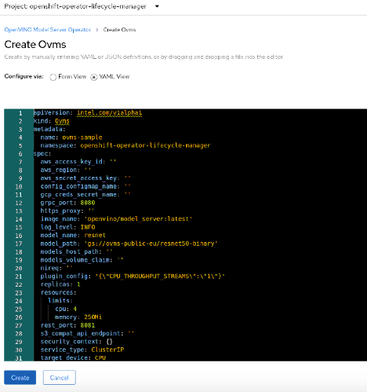

## About this Operator
This Operator is based on a [Helm chart](../../deploy/ovms) for OVMS. It support all the parameters from the helm chart.

It allows for easy deployment and management of OVMS service in the Kubernetes cluster by just creating `Ovms` resource
record.
```bash
kubectl apply -f config/samples/intel_v1alpha1_ovms.yaml
```

## Operator deployment
Deploy the operator using the steps covered in [OperatorHub](https://operatorhub.io)(https://operatorhub.io/operator/ovms-operator)

Alternatively, if you are not using [OLM](https://github.com/operator-framework/operator-lifecycle-manager) component, run commands:
```bash
export IMG=quay.io/openvino/ovms-operator:0.1.0
make install
make deploy IMG=$IMG
```

## Deploying OpenVINO Model Server via the Operator

### OpenShift console

While you deploy OVMS Operator in [OpenShift](https://www.openshift.com/), you can manage the instances of OVMS using
the [web console](https://docs.openshift.com/container-platform/4.6/web_console/web-console.html).

Navigate to the menu `Installed Operators` and click the link `Create Ovms`.
You will be presented with the template of the OVMS deployment configuration:


Adjust the parameters according to your needs. Use helm chart documentation as a [reference about all the parameters](../../deploy/#helm-options-references).


### Kubectl CLI

If you are using opensource Kubernetes, after installing the operator, deploy and manage OVSM deployments by creating `Ovms` Kubernetes records.

It can be done by editing the [sample resource](config/samples/intel_v1alpha1_ovms.yaml) and running a command:

```bash
kubectl apply -f config/samples/intel_v1alpha1_ovms.yaml
```

The parameters are identical to [Helm chart](../../deploy/#helm-options-references).

<b>Note</b>: Some deployment configurations have prerequisites like creating relevant resources in Kubernetes like a secret with credentials,
persistent volume claim or configmap with OVMS configuration file.

## Using the cluster

The operator deploys an OVMS instance as a Kubernetes service with a predefined number of replicas.
The `Service` name is matching the `Ovms` record.
```bash
kubectl get pods
NAME                           READY   STATUS    RESTARTS   AGE
ovms-sample-586f6f76df-dpps4   1/1     Running   0          8h

kubectl get services
NAME          TYPE        CLUSTER-IP       EXTERNAL-IP   PORT(S)             AGE
ovms-sample   ClusterIP   172.25.199.210   <none>        8080/TCP,8081/TCP   8h
```

Kubernetes service with OVMS is exposing the gRPC and REST endpoints for running the inference requests.
Here are the options for accessing the endpoints:
- deploy the client inside the Kubernetes pod in the cluster. The client in the cluster can access the endpoint via the service name or the service cluster-ip.
- configure the service type as the `NodePort` - it will expose the service on the Kubernetes node external IP address
- in the managed Kubernetes cloud deployment use service type as `LoadBalanced` - it will expose the service as external IP address
- configure OpenShift [`route` resource](https://docs.openshift.com/container-platform/4.6/networking/routes/route-configuration.html) 
  or [`ingress` resource](https://kubernetes.io/docs/concepts/services-networking/ingress/) in opensource Kubernetes linked with OVMS service.
  In OpenShift, this operation could be done from the web console.
  


